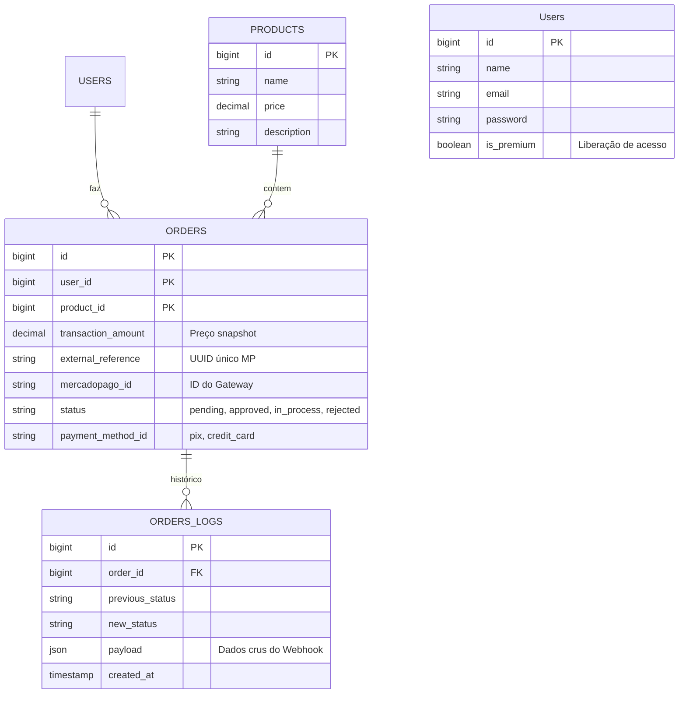
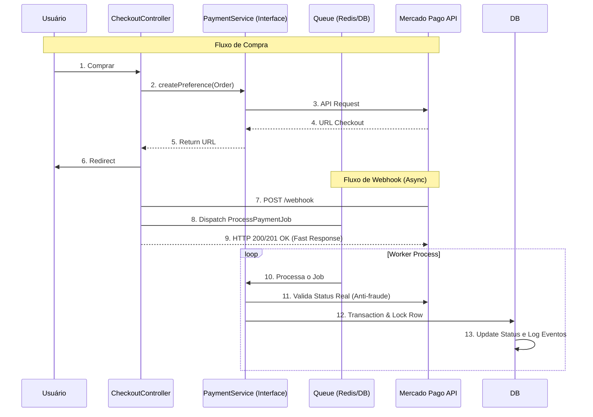
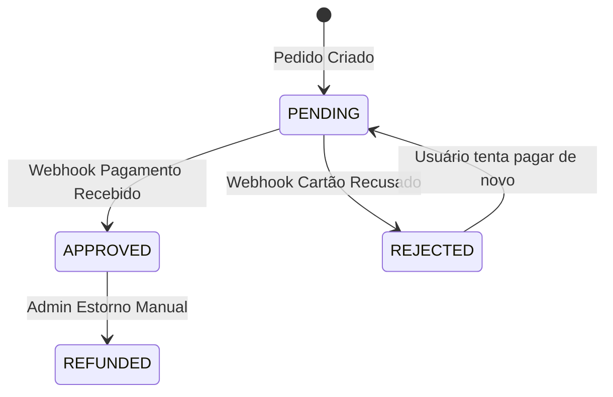

## Objetivo

Sistema de venda simples para produtos digitais (ex: Ebook/Acesso VIP) com liberação automática via Webhook.

## Tech Stack

- **Framework:** Laravel
- **Gateway:** Mercado Pago (SDK PHP)
- **Database:** MySQL
- **Infra Local:** Ngrok (para expor Webhooks)

---

## Banco de Dados (Schema)

A estrutura foca na persistência do pedido e do status de pagamento.

## Fluxo de Pagamento 
O fluxo "Happy Path" de uma compra

## Máquina de Estados (Status do Pedido)
Transições possíveis para o campo `status` do Order.

## Regras de Negócio e Segurança
1. External Reference: É a chave mestra. Nunca criar uma preferência no MP sem enviar um UUID gerado pelo nosso sistema. É ele que garante que sabemos quem pagou o quê quando Webhook chegar.
2. Idempotência: O Webhook pode enviar a mesma notificação múltiplas vezes. Verificar se order já esta aprovada antes de processar para evitar duplicidade.
3. Nunca liberar o acesso(is_premium) baseado no redirecionamento do usuário(Return URL). Apenas o Webhook é confiável.
4. O valor cobrado deve vir sempre do Banco de Dados(products.price), nunca do input do usuário.
